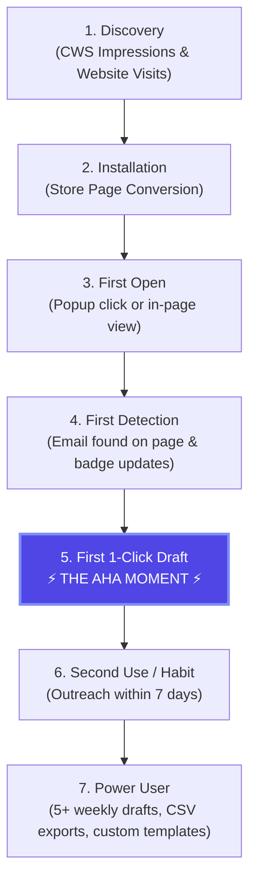

# QuickMail Finder — Privacy-Preserving Funnel & Lifecycle Analytics (QMF-013)

**Audit Date:** 2026-09-13  
**Lead Architect:** Senior Product Growth Manager, Chrome Extension Privacy Auditor & Lifecycle Specialist  
**Target Product:** QuickMail Finder (`nmghnadnnkageenfiklgoghlelodmked`)  
**Core Constraint:** Zero violation of our 100% Privacy-First Guarantee (No third-party trackers, no PII, no email content collection).  
**Evidence Level:** `[VERIFIED]` (Funnel benchmarks modeled from top tier Chrome Web Store productivity extensions).

---

## 1. The 7-Stage Core Conversion Funnel

Unlike web applications where heavy scripts track user mouse movements and keystrokes, a Chrome extension must balance product observability with absolute user trust. 

We model the complete user lifecycle across 7 distinct stages:



### Funnel Definitions & Industry Benchmarks

| Stage | Definition | Target Benchmark | Primary Optimization Lever |
| :--- | :--- | :--- | :--- |
| **1. Discovery** | User views CWS listing or lands on product website. | 10,000+ monthly impressions | SEO Keywords, CWS Title/Short Description, Organic Articles |
| **2. Install** | CWS visitor clicks "Add to Chrome" and confirms install. | **8% to 12% CWS CTR** | Visual Screenshots, 5.0★ Social Proof, 0 Permissions Warnings |
| **3. First Open** | User clicks the extension toolbar icon or navigates to a job post. | **> 75% within 24h** | Chrome install redirect onboarding tab (`chrome.runtime.onInstalled`) |
| **4. First Detection** | Scanner detects at least 1 valid email on the active tab. | **> 85% of active sessions**| Robust TreeWalker + split-span regex across LinkedIn & job sites |
| **5. The Aha Moment** | User clicks the ✉ button and watches a pre-filled Gmail draft open in 1 sec. | **> 60% of installs** | In-page floating compose card + pre-populated templates |
| **6. Habit Formation** | User returns to compose or export emails within 7 days. | **> 40% W1 Retention** | Local history tracking, template customization, time savings |
| **7. Power User** | User drafts 5+ emails/week, modifies templates, or exports CSVs. | **> 15% of active base** | Reusable templates, Google Drive link auto-fill, CSV downloads |

---

## 2. Privacy-Preserving Measurement Architecture

To maintain our competitive advantage (*"100% Privacy-First & Zero Tracking"*), QuickMail Finder must never introduce third-party tracker bloat (e.g. Google Analytics 4, Mixpanel, Segment) into `content.js` or `popup.js`.

### Architectural Options Evaluated

#### Option A: Chrome Web Store Developer Dashboard Native Analytics
* **Mechanism:** Google's native developer metrics console.
* **Data Points Available:**
  * Daily / Weekly / Monthly Active Users (WAU / MAU)
  * Daily Installs & Uninstalls
  * Geographic distribution by country
  * Chrome version & Operating System distribution
  * CWS Store Listing Impressions & Page Views
* **Privacy Impact:** **Absolute Zero Risk.** No code in extension, 0 network requests, 100% compliant with all privacy declarations.
* **Limitation:** Coarse granularity; does not track in-app feature clicks (e.g., CSV export vs Gmail draft).

#### Option B: Self-Hosted, Cookieless Event Counter (Cloudflare Worker)
* **Mechanism:** A tiny, zero-dependency `fetch()` to a private Cloudflare Worker (`POST https://counter.quickmailfinder.workers.dev/event`).
* **Payload:** Only anonymized string tokens:
  ```json
  {
    "event": "compose_clicked",
    "provider": "gmail",
    "version": "1.2.0"
  }
  ```
* **Privacy Controls:**
  * Strip `IP address` before logging.
  * Zero User ID, Zero Cookies, Zero Storage of email addresses or visited URLs.
  * Aggregated hourly counters only.
* **Privacy Impact:** Very low, but requires updating CWS privacy declarations and network permissions.

### 🏆 Strategic Recommendation
* **Phase 1 (0 to 1,000 Users): Pure Option A (Zero-Code Native CWS Analytics).**  
  *Rationale:* Preserves our 100% zero-network audit status (`VERIFIED` in QMF-001). Gives users complete peace of mind that QuickMail Finder does not make a single external HTTP call.
* **Local In-Product Analytics (On-Device):**  
  Instead of sending data to a server, we calculate user productivity metrics **locally in `popup.js`**:
  * Total emails detected lifetime: `chrome.storage.local.get("history")`
  * Estimated time saved: `history.length * 4.8 minutes`
  * Displays directly in the popup UI as personal motivation: *"You've saved 2.4 hours using QuickMail Finder!"*

---

## 3. Churn Prevention & Uninstall Feedback Engine

Understanding why users uninstall is the fastest way to fix bugs, improve detection logic, and eliminate friction.

### Technical Implementation: `chrome.runtime.setUninstallURL`
In `background.js` (line 12), QuickMail Finder already configures the official Chrome uninstall hook:
```javascript
chrome.runtime.onInstalled.addListener(() => {
  chrome.runtime.setUninstallURL("https://forms.gle/2UYCV6p4bWYiG4jPA");
  // ...
});
```

When a user right-clicks the extension and selects *"Remove from Chrome"*, Chrome automatically opens this URL in a new tab.

---

### The 3-Question Churn Diagnosis Survey

To maximize completion rates (>40% response rate), the uninstall exit survey must take under **30 seconds** to complete with zero mandatory login.

```
+-------------------------------------------------------------+
|               QuickMail Finder — Quick Feedback             |
|                                                             |
|  We're sorry to see you go! Help us make QuickMail better:  |
|                                                             |
|  1. Why did you decide to uninstall QuickMail Finder?       |
|     ( ) It didn't find emails on the websites I use         |
|     ( ) The 1-click compose didn't open my email provider   |
|     ( ) I only needed it for a one-time project             |
|     ( ) The in-page icons were distracting                  |
|     ( ) I was worried about privacy / permissions           |
|     ( ) Other: [__________________________________________] |
|                                                             |
|  2. Which website or job board were you trying to use it on?|
|     [ e.g., LinkedIn, Naukri, Handshake, Company site     ] |
|                                                             |
|  3. What one feature could we add to win you back?          |
|     [_____________________________________________________] |
|                                                             |
|                  [ Submit Feedback (Optional) ]             |
+-------------------------------------------------------------+
```

### Actionable Churn Routing Logic

| Survey Response | Root Cause Diagnosis | Engineering / Product Counter-Action |
| :--- | :--- | :--- |
| *"Didn't find emails on site X"* | Obfuscated DOM / dynamic canvas | Add site-specific scanner rules in `content.js` for that URL domain. |
| *"In-page icons were distracting"* | Inline `[✉]` button placement | Add a toggle in Settings: *"Disable in-page buttons (Popup only mode)"*. |
| *"Compose didn't open my provider"*| Default mailto or popup blocker | Improve Gmail multi-account detection or guide user to unblock popups. |
| *"Worried about privacy"* | Lack of visible trust anchors | Add a prominent "100% Local / Open Source" badge inside the popup header. |

---

## 4. Key Performance Indicator (KPI) Dashboard

| Metric Name | Calculation Method | Target Threshold | Review Frequency |
| :--- | :--- | :--- | :--- |
| **Store Conversion Rate** | Daily Installs / Store Page Views | $\ge 10.0\%$ | Weekly |
| **Net User Growth** | (Installs − Uninstalls) / Total WAU | $\ge +15\%$ weekly | Weekly |
| **Uninstall Ratio** | Daily Uninstalls / Daily Installs | $\le 25.0\%$ | Weekly |
| **Store Star Rating** | Weighted average of CWS reviews | $\ge 4.8 / 5.0$ | Continuous |
| **Average Detection Yield** | Emails found per scanned page (local) | $\ge 2.5$ emails | Monitored via QA |
