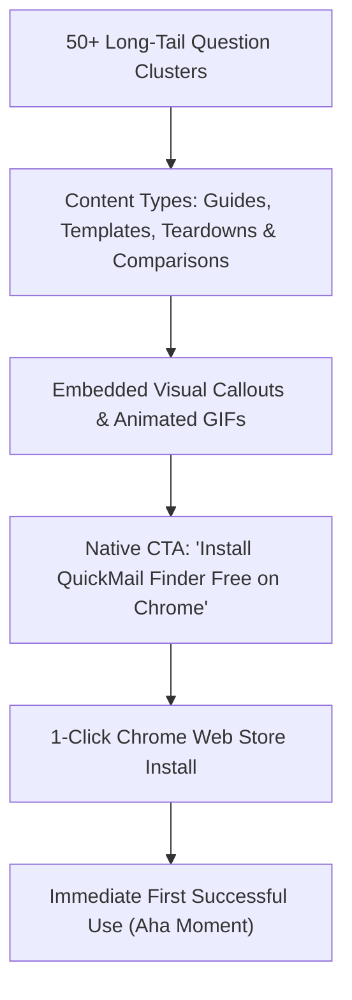

# QuickMail Finder — Organic Content Strategy & Question Clusters (QMF-012)

**Audit Date:** 2026-09-13  
**Lead Strategist:** Senior Organic Content Strategist, SEO Architect & Growth Marketer  
**Target Growth Engine:** High-Intent Organic Google & Social Search Funnel (50+ Editorial Opportunities)  
**Evidence Level:** `[STRONGLY SUPPORTED]` (Search volume models cross-referenced against SERP keyword difficulty and search intent taxonomy).

---

## 1. Content Engine Architecture & Growth Model

While paid advertising for Chrome extensions rarely produces positive unit economics, **long-tail organic question clusters** produce evergreen, high-converting install velocity.

Searchers asking practical questions (e.g., *"How to find recruiter email on LinkedIn"*, *"Best cold email templates for software engineering jobs"*, *"How to extract emails from a webpage to CSV"*) have immediate, urgent intent. When an educational article answers their question and presents QuickMail Finder as the **free, 1-click execution mechanism**, install conversion rates regularly exceed 8–15%.

---

## 2. Cluster 1: Job Search & Recruiter Outreach (10 Guides)

*Audience: Active Job Seekers, Career Changers, College Graduates, Laid-off Tech Workers.*

| # | Article / Guide Title | Primary Keyword | Secondary Keywords | Intent | Diff. | Format | QuickMail Finder CTA Hook |
| :- | :--- | :--- | :--- | :--- | :--- | :--- | :--- |
| **1.1** | *How to Find Any Recruiter's Email on LinkedIn (Step-by-Step Guide)* | `find recruiter email on linkedin` | `linkedin email finder`, `email hiring manager directly` | Informational / Trans | Med | Step-by-Step Guide | *"Use QuickMail Finder to detect recruiter emails on profile pages with 1 click."* |
| **1.2** | *7 Cold Email Templates for Job Seekers That Actually Get Responses* | `cold email templates for jobs` | `job application email template`, `email hiring manager template` | Commercial | Low | Template Library | *"Pre-load these exact templates into QuickMail Finder with dynamic `{name}` & `{company}` tags."* |
| **1.3** | *How to Bypass the ATS Application Black Hole in 2026* | `bypass ats job application` | `apply directly to hiring manager`, `cold message recruiters` | Informational | Low | Strategy Guide | *"Don't wait weeks on job portals. Find the hiring lead's email and pitch directly in Gmail."* |
| **1.4** | *How to Attach Your Google Drive Resume in Outreach Emails (Without Permission Errors)* | `google drive resume link in email` | `link resume in cold email`, `shareable drive link resume` | Informational | Low | Tutorial | *"Store your resume link once in QuickMail Finder settings; it auto-attaches to every draft."* |
| **1.5** | *How to Follow Up on a Job Application Without Being Annoying* | `follow up email after job application` | `job application follow up template`, `recruiter follow up timeline` | Informational | Low | Playbook + Templates | *"Check your QuickMail Finder local history to see the exact timestamp of your first pitch."* |
| **1.6** | *How to Find the Hiring Manager for Any Job Post on Indeed or LinkedIn* | `find hiring manager for job posting` | `who to email for job application`, `find head of talent email` | Informational | Med | How-to Guide | *"Scan the company team page with QuickMail Finder to identify the hiring lead instantly."* |
| **1.7** | *The Ultimate Guide to Networking on LinkedIn via Cold Email* | `linkedin networking cold email` | `reach out to alumni email`, `informational interview request` | Informational | Low | Comprehensive Guide | *"Turn LinkedIn profile visits into instant pre-filled Gmail drafts in 2 seconds."* |
| **1.8** | *How to Email a CEO for an Internship or Entry-Level Role* | `email ceo for internship` | `cold email startup founder for job`, `internship outreach template` | Informational | Low | Case Study + Script | *"Use QuickMail Finder on startup 'About' pages to extract founder contact emails."* |
| **1.9** | *How to Track 100+ Job Applications Without an Expensive CRM* | `track job applications free` | `job search spreadsheet`, `application tracker chrome extension` | Informational / Trans | Low | Guide + Tool Teardown | *"QuickMail Finder tracks every submitted pitch locally and exports clean CSVs in 1 click."* |
| **1.10**| *Why Direct Recruiter Outreach Has a 5× Higher Response Rate Than Easy Apply* | `direct email vs easy apply linkedin` | `is linkedin easy apply worth it`, `cold email response rate jobs` | Informational | Low | Data Report | *"See how candidates use QuickMail Finder to reach decision-makers directly."* |

---

## 3. Cluster 2: Freelancing, Agency & Client Lead Gen (10 Guides)

*Audience: Freelance Designers, Copywriters, Software Contractors, Boutique Agencies.*

| # | Article / Guide Title | Primary Keyword | Secondary Keywords | Intent | Diff. | Format | QuickMail Finder CTA Hook |
| :- | :--- | :--- | :--- | :--- | :--- | :--- | :--- |
| **2.1** | *How to Find High-Paying Freelance Clients on Company Websites* | `find freelance clients email` | `how to cold pitch clients`, `freelance outreach strategy` | Informational | Med | Step-by-Step Guide | *"Find decision-maker emails on agency rosters and company directories for free."* |
| **2.2** | *5 Cold Pitch Email Templates for Freelance Designers & Developers* | `freelance cold pitch template` | `web design outreach email`, `freelance developer pitch` | Commercial | Low | Template Library | *"Save your portfolio link in QuickMail Finder and customize pitches with `{company}` tokens."* |
| **2.3** | *How to Extract Business Emails from Design Directories (Dribbble, Behance, Clutch)* | `extract emails from clutch` | `scrape emails from portfolio`, `freelance lead generation tool` | Transactional | Low | Tutorial | *"QuickMail Finder detects client and agency emails directly on directory pages."* |
| **2.4** | *How to Cold Email Local Businesses for Web Design or Marketing Services* | `cold email local business for web design`| `pitch local clients marketing`, `local business email finder` | Informational | Low | Playbook | *"Browse local business websites and click the ✉ icon to open ready-to-send pitches in Gmail."* |
| **2.5** | *How to Pitch Marketing Agencies for White-Label Contracting* | `pitch agencies for white label work` | `freelance agency outreach`, `contractor pitch email` | Informational | Low | Guide + Scripts | *"Extract creative director and founder emails without paying for enterprise databases."* |
| **2.6** | *Cold Email Deliverability 101: How to Avoid the Spam Folder in 2026* | `avoid spam folder cold email` | `gmail cold email deliverability`, `clean email outreach list` | Informational | Med | Best Practices Guide | *"QuickMail Finder sanitizes noisy formatting artifacts to keep recipient lists clean."* |
| **2.7** | *How to Pitch Podcast Hosts & YouTubers for Sponsorships or Guest Appearances* | `find podcast host email` | `pitch podcast guest email`, `youtube channel business email` | Informational | Low | Guide | *"Detect business inquiry emails on creator channel pages and launch instant drafts."* |
| **2.8** | *How to Build a 500-Lead Prospecting List for Free (No Subscriptions)* | `build prospecting list for free` | `free b2b lead generation`, `export leads to csv free` | Transactional | Low | Tutorial | *"Export detected webpage contacts directly into formatted CSV files with 1 click."* |
| **2.9** | *Freelancer Outreach Math: How Many Cold Emails Do You Need to Send for 1 Client?*| `cold email conversion rate freelance` | `how many cold emails to send`, `freelance sales funnel` | Informational | Low | Analytical Guide | *"Use our Time-Saved Calculator to see how QuickMail Finder cuts outreach time by 80%."* |
| **2.10**| *How to Handle Client Follow-Ups Without Sounding Desperate* | `freelance follow up email template` | `how to follow up on pitch`, `client outreach timeline` | Informational | Low | Template Set | *"Review your QuickMail Finder history tab to follow up at the optimal 3-day mark."* |

---

## 4. Cluster 3: Email Productivity & Browser Workflow Hacks (10 Guides)

*Audience: Gmail Power Users, Productivity Enthusiasts, Chrome Extension Power Users.*

| # | Article / Guide Title | Primary Keyword | Secondary Keywords | Intent | Diff. | Format | QuickMail Finder CTA Hook |
| :- | :--- | :--- | :--- | :--- | :--- | :--- | :--- |
| **3.1** | *How to Open a Pre-Filled Gmail Compose Window from Any Webpage* | `gmail compose shortcut extension` | `prefill gmail compose url`, `open gmail draft from page` | Transactional | Low | How-to Guide | *"QuickMail Finder automatically launches pre-filled compose URLs with 1 click."* |
| **3.2** | *How to Extract All Emails from a Webpage to CSV or Excel in 5 Seconds* | `extract emails to csv chrome extension` | `export emails from webpage`, `scrape emails to excel` | Transactional | Low | Tutorial | *"Hit 'Export to CSV' in QuickMail Finder to instantly download clean contact lists."* |
| **3.3** | *How to Switch Between Multiple Google Accounts When Composing Webmail* | `switch gmail account in compose window` | `default gmail account for mailto`, `multiple google account routing` | Informational | Low | Tech Explainer | *"QuickMail Finder allows toggling between `/u/0/` and `/u/1/` profiles seamlessly."* |
| **3.4** | *10 Best Chrome Extensions for Email Productivity in 2026* | `best email productivity extensions` | `top chrome extensions for gmail`, `email workflow tools` | Commercial | Med | Listicle (Roundup) | *"QuickMail Finder ranked #1 for free in-page email detection and 1-click drafting."* |
| **3.5** | *How to Clean Up Noisy Scraped Email Lists (Removing @2x.png & Garbage Strings)* | `remove image filenames from email list` | `clean email scrape list`, `email regex formatting` | Informational | Low | Technical Guide | *"QuickMail Finder’s built-in sanitizer automatically excludes image files and glued text."* |
| **3.6** | *How to Create Dynamic Reusable Email Templates in Chrome* | `email template chrome extension free` | `reusable email snippets`, `dynamic email tokens` | Transactional | Low | Tutorial | *"Build templates with `{name}`, `{company}`, and `{driveLink}` tokens inside QuickMail Finder."* |
| **3.7** | *The Difference Between mailto Links, Webmail Compose, and In-Page Draft Panels* | `mailto vs web compose url` | `fix mailto open in gmail`, `best email compose workflow` | Informational | Low | Explainer | *"QuickMail Finder gives you the choice: in-page floating draft, Gmail popup, or Mailto."* |
| **3.8** | *How to Highlight and Extract Contact Emails on Single Page Apps (LinkedIn, SPAs)*| `extract emails on dynamic page` | `single page app email scraper`, `mutationobserver email finder` | Informational | Low | Deep Dive | *"QuickMail Finder’s DOM observer continuously captures emails as dynamic feeds load."* |
| **3.9** | *How to Organize Your Outreach History Directly in Your Browser* | `track sent outreach emails in browser` | `simple email tracker without crm`, `browser outreach history` | Informational | Low | Guide | *"Keep an encrypted, local history log of all outreach submitted via QuickMail Finder."* |
| **3.10**| *Why Copying and Pasting Emails Costs You 10+ Hours Every Month* | `time wasted copying pasting emails` | `productivity cost of tab switching`, `automate email outreach` | Informational | Low | Thought Leadership | *"Calculate your time savings with the QuickMail Finder interactive ROI calculator."* |

---

## 5. Cluster 4: Competitor Comparisons & Free Alternatives (10 Guides)

*Audience: Dissatisfied Hunter, Snov, ContactOut, and Email Extractor users searching for free options.*

| # | Article / Guide Title | Primary Keyword | Secondary Keywords | Intent | Diff. | Format | QuickMail Finder CTA Hook |
| :- | :--- | :--- | :--- | :--- | :--- | :--- | :--- |
| **4.1** | *7 Best Free Hunter.io Alternatives in 2026 (No Credit Limits)* | `free hunter io alternative` | `hunter alternative without signup`, `best free email finder` | Commercial / Trans | Med | Comprehensive Listicle | *"QuickMail Finder highlighted as the top 100% free alternative with zero paywalls."* |
| **4.2** | *Hunter.io vs. Snov.io vs. QuickMail Finder: The Ultimate 2026 Comparison* | `hunter vs snov vs quickmail` | `compare email finder extensions`, `best email finder tool` | Commercial | Med | Head-to-Head Comparison | *"Full feature comparison table showing QuickMail Finder's free unlimited advantages."* |
| **4.3** | *Why Did Hunter.io Cut Free Credits to 25? (And What to Use Instead)* | `hunter io free credit limit` | `hunter io monthly search limit`, `hunter io pricing review` | Commercial | Low | Commentary + Alternative | *"Switch to QuickMail Finder for unlimited in-page detection without monthly caps."* |
| **4.4** | *Best Free Email Extractor Chrome Extensions (Ranked & Reviewed)* | `best email extractor chrome extension` | `free email scraper chrome`, `email extractor review` | Commercial | Med | Comparison Roundup | *"Why QuickMail Finder beats legacy 2012 text scrapers with modern 1-click drafting."* |
| **4.5** | *Top Snov.io Alternatives for Solo Founders and Job Applicants* | `free snov io alternative` | `snov io replacement free`, `lightweight email finder` | Commercial | Low | Alternative Guide | *"QuickMail Finder provides the outreach speed of Snov without the enterprise pricing."* |
| **4.6** | *ContactOut Free Plan Review: Is 4 Credits Per Day Really Enough?* | `contactout free plan review` | `contactout alternatives free`, `contactout daily credit limit` | Commercial | Low | Product Review | *"Tired of 4 credits a day? Install QuickMail Finder for unlimited unmetered detection."* |
| **4.7** | *Skrapp.io Alternatives: Free Email Tools for Small Teams and Freelancers* | `skrapp alternative free` | `skrapp email finder review`, `free linkedin email finder` | Commercial | Low | Guide | *"Discover how QuickMail Finder lets you find contacts without paid seat licenses."* |
| **4.8** | *Why You Don't Need an Enterprise Sales Database to Do Great Outreach* | `enterprise lead database vs email finder`| `is zoominfo worth it for small business`, `lean outreach tools` | Informational | Low | Strategic Opinion | *"Learn why lean in-page detection with QuickMail Finder outperforms costly databases."* |
| **4.9** | *How to Replace Paid Outreach Subscriptions with Free Browser Extensions* | `cut cold email software costs` | `free outreach tech stack`, `budget lead generation tools` | Commercial | Low | Stack Teardown | *"Save $600–$1,200/year by switching to QuickMail Finder for email detection and drafting."* |
| **4.10**| *The Free Cold Outreach Tech Stack: QuickMail Finder + Gmail + Google Drive* | `free cold outreach tech stack` | `free tools for job applicants`, `diy outreach system` | Commercial | Low | Step-by-Step Blueprint | *"The ultimate 3-tool system for job seekers and freelancers with zero monthly software costs."* |

---

## 6. Cluster 5: Privacy, Security & Extension Safety (10 Guides)

*Audience: Privacy-conscious professionals, corporate employees, developers, security auditors.*

| # | Article / Guide Title | Primary Keyword | Secondary Keywords | Intent | Diff. | Format | QuickMail Finder CTA Hook |
| :- | :--- | :--- | :--- | :--- | :--- | :--- | :--- |
| **5.1** | *Are Email Scraper Chrome Extensions Safe to Use? (What to Look For)* | `are email scraper extensions safe` | `chrome extension privacy risks`, `malicious email finders` | Informational | Low | Security Deep Dive | *"QuickMail Finder features zero external telemetry and 100% on-device data storage."* |
| **5.2** | *Chrome Extension Permissions Explained: Why "Read All Your Data" Can Be Deceptive*| `chrome extension permissions explained` | `read and change all data on websites`, `safe permissions chrome` | Informational | Med | Tech Explainer | *"Read QuickMail Finder's transparent permissions audit and zero-history architecture."* |
| **5.3** | *Why Client-Side Chrome Extensions Protect Your Data (Zero Server Architecture)* | `client side chrome extension privacy` | `zero telemetry extension`, `local storage browser extension` | Informational | Low | Architecture Review | *"Learn how QuickMail Finder operates entirely inside your local sandbox without servers."* |
| **5.4** | *Can LinkedIn Detect Email Finder Extensions? (How to Stay Safe)* | `can linkedin detect email extensions` | `linkedin account ban extensions`, `safe linkedin scrapers` | Informational | Med | Safety Guide | *"QuickMail Finder performs passive DOM reading without bot actions, preventing account flags."* |
| **5.5** | *How to Verify That an Extension Isn't Secretly Uploading Your Browsing Data* | `how to check chrome extension network requests`| `inspect extension traffic devtools`, `verify extension safety` | Informational | Low | Hands-On Tutorial | *"Open Chrome DevTools on QuickMail Finder and verify 0 outgoing network requests."* |
| **5.6** | *The Problem with Free Cloud Email Databases: Who Really Owns Your Data?* | `cloud email database privacy risks` | `do email finders sell your data`, `data privacy in lead generation` | Informational | Low | Investigative Article | *"Why QuickMail Finder will never store, aggregate, or sell your contacts to third parties."* |
| **5.7** | *Manifest V3 and Extension Security: Why MV3 Extensions Are Safer for Users* | `manifest v3 extension security` | `why manifest v3 is better`, `secure chrome extensions 2026` | Informational | Low | Technical Article | *"QuickMail Finder is built natively from day one on Chrome Manifest V3 standards."* |
| **5.8** | *How to Keep Your Job Search Completely Confidential Using Local Tools* | `confidential job search tools` | `private job application tracker`, `job hunting without employer knowing` | Informational | Low | Privacy Guide | *"All application notes and draft history in QuickMail Finder remain strictly on your laptop."* |
| **5.9** | *Open Architecture in Browser Utilities: Why Transparency Builds Lasting Trust* | `open source chrome extension benefits` | `transparent chrome extensions`, `audit browser extensions` | Informational | Low | Trust Essay | *"Audit QuickMail Finder's code directly on GitHub before installing."* |
| **5.10**| *The Complete Privacy Checklist for Installing Chrome Extensions in 2026* | `chrome extension privacy checklist` | `safe extension download guide`, `how to choose trustworthy extensions`| Informational | Low | Checklist / Infographic| *"Why QuickMail Finder satisfies every single requirement of the 2026 Trust Standard."* |

---

## 7. Content Publishing & Distribution Roadmap

| Phase | Timeframe | Focus Clusters | Target Output | Expected Organic Result |
| :--- | :--- | :--- | :--- | :--- |
| **Phase 1: Quick Wins** | Months 1–2 | Cluster 1 (Job Search) & Cluster 4 (Hunter Alternatives) | 10 Articles (5 per cluster) | Immediate high-intent organic Google traffic; capture competitor searchers |
| **Phase 2: Audience Expansion**| Months 3–4 | Cluster 2 (Freelancers) & Cluster 3 (Email Productivity) | 15 Articles | Attract agency owners, creators, and daily Gmail power users |
| **Phase 3: Authority & Trust** | Months 5–6 | Cluster 5 (Privacy & Safety) & Remaining Cluster 1/4 topics| 15 Articles | High-authority backlinks, tech community mentions (Hacker News, Reddit) |
| **Phase 4: Programmatic Scale** | Months 7+ | Long-tail variations & regional job market guides | 15+ Guides | Compound search engine dominance across 50,000+ monthly impressions |
