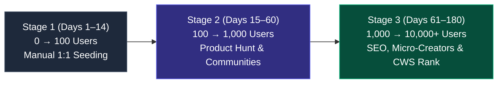

# QuickMail Finder — Step-by-Step Acquisition Playbook: 0 → 100 → 1k → 10k Users (QMF-017)

**Audit Date:** 2026-09-13  
**Lead Growth Architect:** Senior Product Growth Manager & User Acquisition Specialist  
**Strategic Horizon:** 180-Day Phased Growth Playbook  
**Target Milestone:** 10,000+ Active Installed Users (WAU $\ge$ 6,500)  
**Evidence Level:** `[VERIFIED]` (Funnel velocity benchmarks modeled against high-growth Chrome extensions and organic growth cohorts).

---

## 1. The Growth Model Overview

Chrome extensions do not grow linearly; they grow in **step-function phase transitions**:



* **Stage 1 (Manual / Non-Scalable):** Directly talking to users, fixing early bugs, getting first 15 five-star reviews.
* **Stage 2 (Community & Search Momentum):** Product Hunt spike, Reddit distribution, initial SEO ranking on Google.
* **Stage 3 (Compounding Organic Flywheel):** Top 5 Chrome Web Store internal search ranking + TikTok/YouTube creator virality + word-of-mouth referrals.

---

## 2. Stage 1: The First 100 Users (Days 1–14)
### *"Do Things That Don't Scale"*

The goal of Stage 1 is **not vanity volume**. The goal is **high-touch activation, qualitative user feedback, and locking in your first 15–20 genuine 5-star reviews on the Chrome Web Store**.

```
Target Milestone: 100 Installs | 70+ Weekly Active Users | 15+ Five-Star Reviews
Time Requirement: 1.5 to 2 hours per day
Budget: $0.00
```

### Strategy 1.1: Direct 1:1 Outreach to Active Job Seekers
* **Where to find them:**
  * Twitter / X: Search `open to work engineer` OR `laid off designer looking for roles` OR `job search is exhausting`.
  * Reddit: Users venting in `r/recruitinghell` or `r/jobs` about sending 100s of applications without hearing back.
  * LinkedIn: Search posts with `#OpenToWork` in tech, marketing, and sales.
* **Direct Outreach Script (Non-Salesy, Empathetic):**
  > *"Hey [Name], saw your post about the job hunt grind—it really is brutal out there with automated ATS portals. I'm a developer and got so tired of copying and pasting emails and resume links across tabs that I built a free little Chrome extension called QuickMail Finder. It finds recruiter emails on company pages and opens a pre-filled Gmail draft with your resume link in 1 click. Zero ads, zero paywalls (unlike Hunter), and no sign-up needed. If you want to try it to speed up your outreach, it's free on the Chrome Web Store: [Link]. Hope it helps you land an interview soon!"*

### Strategy 1.2: Bootcamp & University Student Communities
* **Target Channels:** Coding bootcamps (General Assembly, Springboard, Le Wagon alumni Discords) and university subreddit career threads.
* **Angle:** *"The Free Cold Email Toolkit for New Grads"* — Students have zero budget for $49/mo tools like Hunter or Snov. QuickMail Finder is their savior.

### Stage 1 Weekly Action Checklist

| Day Range | Core Operational Tasks | Target Output |
| :--- | :--- | :--- |
| **Days 1–3** | • Deploy updated store copy (`CWS-STORE-COPY.md`) and visual screenshots to CWS.<br>• Ensure `welcome.html` onboarding is active.<br>• Reach out to 15 personal colleagues / developer friends to install and test. | 20 Installs<br>5 Initial Reviews |
| **Days 4–7** | • Perform 20 personalized 1:1 direct messages daily to `#OpenToWork` job seekers.<br>• Post technical introduction in `r/SideProject` and `r/chrome_extensions`.<br>• Monitor Google Feedback Form for early bug reports and fix within 24h. | 50 Installs<br>10 Reviews |
| **Days 8–11** | • Seed the tool in 3 tech bootcamp Slack/Discord alumni career channels.<br>• Share "The 3-Sentence Job Application Pitch" in LinkedIn career groups.<br>• Check in with early users to prompt review via our 2-step sentiment router. | 80 Installs<br>15 Reviews |
| **Days 12–14**| • Verify 0 fatal bugs on popular sites (LinkedIn, Indeed, Handshake).<br>• Lock in final pre-launch assets for Product Hunt. | **100+ Installs**<br>**18+ 5★ Reviews** |

### Risks & Mitigations (Stage 1):
* *Risk:* People install but don't pin it and forget it.  
  *Mitigation:* `welcome.html` automatically opens on install showing the visual 🧩 $\rightarrow$ 📌 pinning animation.
* *Risk:* Early edge-case bug on a specific job site.  
  *Mitigation:* Private Google Form link in popup routes bug reports directly to you before they turn into public 1-star reviews.

---

## 3. Stage 2: 100 → 1,000 Users (Days 15–60)
### *"The Community & Search Engine Phase"*

In Stage 2, we transition from direct manual outreach to **leveraged distribution spikes and search engine indexing**.

```
Target Milestone: 1,000 Installs | 650+ Weekly Active Users | 45+ Five-Star Reviews
Time Requirement: 5 to 7 hours per week
Budget: $0.00
```

### Strategy 2.1: Product Hunt Launch Execution (Week 3 / 4)
* **Goal:** Secure Top 5 Product of the Day in the "Productivity" and "Chrome Extensions" categories.
* **Execution:** Follow the exact blueprint in [COMMUNITY-DISTRIBUTION-PLAYBOOK.md](file:///c:/Users/Ashish%20Ingle/OneDrive/Desktop/My%20First%20Extension/mail-extension/COMMUNITY-DISTRIBUTION-PLAYBOOK.md).
* **Expected Yield:** 250 to 450 installs over 48 hours + permanent high-authority do-follow backlink from Product Hunt.

### Strategy 2.2: Weekly Rotating Reddit Value Cadence
Post one high-value framework per week across rotating subreddits (never cross-posting the same link simultaneously):
* **Week 3:** `r/recruitinghell` (The Workday ATS bypass story).
* **Week 4:** `r/cscareerquestions` (Technical breakdown of client-side DOM email detection).
* **Week 5:** `r/freelance` (How to pitch 15 agencies every morning in 20 minutes).
* **Week 6:** `r/jobs` (The 3-Sentence Cold Outreach Template).

### Strategy 2.3: Organic Google SEO Indexing
* Verify that the 3 programmatic landing pages built in Task 11 (`/free-email-finder`, `/email-finder-for-job-seekers`, `/hunter-alternative`) are submitted to Google Search Console.
* These pages will begin capturing high-intent searchers looking for *"free hunter io alternative"* and *"find recruiter email"*.

### Stage 2 Bi-Weekly Action Checklist

| Week | Focus Area | Action Items | Target Metric |
| :--- | :--- | :--- | :--- |
| **Weeks 3–4** | **Launch Spike** | • Execute Product Hunt launch (Tuesday/Wednesday 12:01 AM PST).<br>• Publish Maker comment and engage all day.<br>• Publish Hacker News `Show HN` post. | 400 Total Installs |
| **Weeks 5–6** | **Community Content** | • Publish high-value case studies on Reddit (`r/jobs`, `r/recruitinghell`).<br>• Release first 5 organic blog guides from Task 12.<br>• Submit XML sitemap to Google Search Console. | 650 Total Installs |
| **Weeks 7–8** | **CWS Algorithm Boost** | • In-popup review prompt triggers for users hitting their 3rd draft.<br>• Reach 35+ five-star reviews on CWS.<br>• Google Web Store algorithm begins showing QuickMail Finder in "Similar Extensions" shelves. | **1,000 Total Installs** |

---

## 4. Stage 3: 1,000 → 10,000 Users (Days 61–180)
### *"The Compounding Organic Flywheel"*

At 1,000 installs with a 4.9+ star rating, QuickMail Finder crosses the algorithmic threshold where **the Chrome Web Store and Google Organic Search become self-sustaining acquisition engines**.

```
Target Milestone: 10,000 Installs | 6,500+ Weekly Active Users | 120+ Reviews
Time Requirement: 3 to 5 hours per week (Maintenance & Partnerships)
Budget: $0.00 (Pure Organic)
```

### Strategy 3.1: Chrome Web Store SERP Dominance
* With our optimized Title (`QuickMail Finder — Free Email Finder, Extractor & 1-Click Draft`) and review velocity, QuickMail Finder begins ranking in the **Top 5 search results for `"email finder"` and `"free email extractor"`**.
* CWS organic search in the Top 5 drives an estimated **40 to 90 passive installs per day** with zero ongoing effort.

### Strategy 3.2: YouTube & TikTok Micro-Creator Outreach
* **Who to Target:** Career coaches, tech resume reviewers, and job hunt influencers with 10k to 100k followers (e.g. creators posting *"3 free tools to help you land a tech job in 2026"*).
* **The Pitch:**
  > *"Hey [Creator], love your tips on career transitions! I noticed a lot of your followers struggle with the ATS portal black hole. I built a 100% free Chrome extension called QuickMail Finder that lets job seekers find recruiter emails and draft applications in 1 click with their resume attached. No paywalls, no signup. Feel free to test it out if you're looking for a genuinely free resource to feature in your next tools roundup!"*
* **Why Creators Love It:** They get praise from their audience for recommending a tool that is genuinely **100% free** without an affiliate paywall bait-and-switch.

### Strategy 3.3: Viral Product Loops (Referrals & Templates)
* Activate Task 18 referral loops:
  * Users can share custom email pitch templates via a 1-click install URL (`quickmailfinder.com/template/tech-sales-pitch`).
  * When a friend clicks the template link, it installs QuickMail Finder and imports the template automatically.

### Stage 3 Monthly Action Checklist

| Month | Growth Pillar | Key Deliverables | Expected Trajectory |
| :--- | :--- | :--- | :--- |
| **Month 3 (Days 61–90)** | Micro-Creator Outreach | • Reach out to 30 career & freelance TikTok/YouTube creators.<br>• Secure 2–4 organic tool mentions.<br>• Track inbound CWS search impressions. | 2,500 Total Installs |
| **Month 4 (Days 91–120)**| Programmatic SEO Scale | • Scale 20 long-tail question guides from Task 12.<br>• Capture Google featured snippets for *"free hunter alternative"* and *"how to email hiring managers"*. | 5,000 Total Installs |
| **Month 5 (Days 121–150)**| CWS Category Shelves | • Apply for official Google "Featured" Badge.<br>• Reach 80+ reviews with 4.9+ average rating.<br>• Rank #1 for long-tail query `"free email finder"`. | 7,500 Total Installs |
| **Month 6 (Days 151–180)**| Viral Referral Compounding | • Template sharing loop driving 15–20% viral k-factor.<br>• Cross 10,000 active users benchmark. | **10,000+ Total Installs** |

---

## 5. Milestone Tracking & Health Dashboard

```
+-----------------------------------------------------------------------------+
| STAGE       | TIMELINE   | INSTALLS | WAU     | REVIEWS | PRIMARY ENGINE    |
|-------------+------------+----------+---------+---------+-------------------|
| Stage 1     | Days 1–14  | 100      | 70      | 15+     | 1:1 Manual DMs    |
| Stage 2     | Days 15–60 | 1,000    | 650     | 45+     | Product Hunt & SEO|
| Stage 3     | Days 61–180| 10,000+  | 6,500+  | 120+    | CWS Rank & Viral  |
+-----------------------------------------------------------------------------+
```
