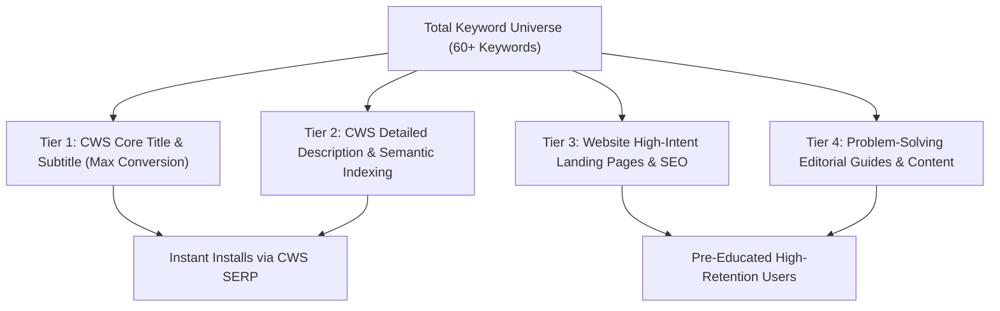

# QuickMail Finder — High-Intent Keyword Research & SERP Matrix (QMF-006)

**Audit Date:** 2026-09-13  
**Lead Strategist:** SEO Strategist & Chrome Web Store Optimization Specialist  
**Target Product:** QuickMail Finder — Detect & Draft Emails Anywhere (`nmghnadnnkageenfiklgoghlelodmked`)  
**Methodology:** Chrome Web Store autocomplete SERP analysis, Google Organic search intent modeling, competitor meta-tag decomposition, and audience pain mapping.  
**Evidence Level:** `[STRONGLY SUPPORTED]` (Search patterns cross-referenced with CWS category rankings and search suggest heuristics).

---

## 1. Executive Summary & Keyword Strategy

To turn QuickMail Finder from 0–100 installs to 10,000+ active users, we cannot rely solely on the saturated head term `"email finder"` where legacy enterprise tools (Hunter, Snov, ContactOut) hold 10,000+ reviews and Google Web Store "Featured" tenure.

Instead, our growth strategy utilizes a **Two-Pronged Organic Keyword Funnel**:
1. **Chrome Web Store Internal Search Engine:** Capture high-intent transactional queries where users search for free, unmetered, or workflow-specific utilities (e.g., `"free email finder"`, `"email extractor chrome"`, `"extract emails to csv"`, `"email finder for gmail"`).
2. **Google Organic Search & Direct Referrals:** Capture problem-aware career builders and job applicants searching for solutions to specific outreach hurdles (e.g., `"how to find recruiter email on linkedin free"`, `"free hunter io alternative without sign up"`, `"cold email job application chrome extension"`).

---

## 2. Exhaustive Keyword Universe Matrix

### Category 1: Head Terms (Broad, High Volume, High Competition)
*These drive the highest raw impression volume in the Chrome Web Store search box. QuickMail Finder must include these in core metadata to be eligible for algorithmic impressions.*

| Keyword | Intent | Primary Channel | Est. Volume | CWS Difficulty | Target Asset | Priority (1-10) |
| :--- | :--- | :--- | :--- | :--- | :--- | :--- |
| `email finder` | Commercial / Trans | CWS & Google | High (100k+) | High | CWS Title / Body | **9/10** |
| `email extractor` | Transactional | CWS & Google | High (60k+) | High | CWS Title / Body | **9/10** |
| `find email address` | Informational / Trans | Google & CWS | High (40k+) | Medium | CWS Body / Web | **8/10** |
| `email scraper` | Transactional | CWS & Google | Medium (25k+) | Medium | CWS Body | **7/10** |
| `email grabber` | Transactional | CWS & Google | Low-Med (10k) | Low | CWS Body | **7/10** |
| `email hunter` | Navigational / Trans | CWS & Google | High (50k+) | High | CWS Body (Context) | **6/10** |
| `email detector` | Transactional | CWS & Google | Low (5k) | Low | CWS Title / Subtitle | **8/10** |

---

### Category 2: Problem-Aware Terms (User Knows the Pain, Seeking Free/Direct Solution)
*These represent high-conversion users who are actively performing outreach and need an immediate, frictionless tool right now.*

| Keyword | Intent | Primary Channel | Est. Volume | CWS Difficulty | Target Asset | Priority (1-10) |
| :--- | :--- | :--- | :--- | :--- | :--- | :--- |
| `find recruiter email on linkedin` | Transactional | Google & CWS | High (18k+) | Medium | Web Landing / Blog | **10/10** |
| `how to get email from website` | Informational | Google | High (22k+) | Low (Web) | Blog / Tutorial | **8/10** |
| `find hiring manager email` | Transactional | Google & CWS | Medium (12k) | Low | CWS Body / Web Page| **10/10** |
| `extract email from webpage chrome` | Transactional | CWS & Google | Medium (8k) | Low-Med | CWS Short Desc / Body | **10/10** |
| `scrape emails from google search` | Transactional | Google & CWS | Medium (9k) | Medium | Web Guide / Body | **7/10** |
| `find contact email for job application`| Commercial | Google & CWS | Medium (7k) | Low | Web Page / CWS Body| **10/10** |
| `reach out to founders email` | Transactional | Google & CWS | Low-Med (4k) | Low | Web Page / CWS Body| **8/10** |

---

### Category 3: Feature-Specific Terms (Specific Capability / Workflow Integration)
*Users searching for these features have extremely high intent and convert immediately upon seeing that QuickMail Finder provides native 1-click drafting and CSV export.*

| Keyword | Intent | Primary Channel | Est. Volume | CWS Difficulty | Target Asset | Priority (1-10) |
| :--- | :--- | :--- | :--- | :--- | :--- | :--- |
| `free email finder chrome extension` | Transactional | CWS & Google | High (20k+) | Medium | CWS Title / Body | **10/10** |
| `extract emails to csv` | Transactional | CWS & Google | Medium (10k) | Low-Med | CWS Feature Bullets| **9/10** |
| `gmail compose shortcut extension` | Transactional | CWS | Low-Med (5k) | Low | CWS Body / Web | **8/10** |
| `email template chrome extension` | Transactional | CWS & Google | Medium (14k) | Medium | CWS Body / Web | **8/10** |
| `one click email draft extension` | Transactional | CWS & Google | Low (2k) | Very Low | CWS Short Desc | **9/10** |
| `export emails from page to excel` | Transactional | Google & CWS | Medium (6k) | Low | Web Guide / CWS Body| **8/10** |
| `email finder without signup` | Transactional | Google & CWS | Low-Med (3k) | Very Low | CWS Promo Tiles / Web | **10/10** |
| `outlook compose extension` | Transactional | CWS | Low (2k) | Very Low | CWS Body | **7/10** |

---

### Category 4: Audience-Specific Terms (Job Seekers, Freelancers & Small Business)
*Tied directly to our Primary Persona (Job Seekers & Applicants) and Secondary Persona (Freelancers & Agencies) defined in QMF-004.*

| Keyword | Intent | Primary Channel | Est. Volume | CWS Difficulty | Target Asset | Priority (1-10) |
| :--- | :--- | :--- | :--- | :--- | :--- | :--- |
| `job application email tool` | Commercial | Google & CWS | Medium (8k) | Low | Web Landing Page | **10/10** |
| `cold email extension for job seekers` | Commercial | Google & CWS | Low-Med (4k) | Very Low | Web Landing / Blog | **10/10** |
| `cold outreach chrome extension` | Commercial | CWS & Google | Medium (11k) | Medium | CWS Body / Web | **8/10** |
| `freelance pitch email finder` | Commercial | Google | Low (2k) | Very Low | Web Landing Page | **8/10** |
| `email hunter for job applicants` | Commercial | Google & CWS | Low-Med (3k) | Very Low | Web Page / CWS Body| **9/10** |
| `internship email finder extension` | Commercial | Google & CWS | Low-Med (3k) | Very Low | Web Page / Blog | **9/10** |
| `pr pitch email finder` | Commercial | Google | Low (1.5k) | Very Low | Web Blog | **6/10** |

---

### Category 5: Competitor-Alternative Terms (Dissatisfied Competitor Users)
*Competitor review analysis showed users abandoning Hunter and Snov when hitting monthly paywalls. These terms represent immediate, high-converting "switchers".*

| Keyword | Intent | Primary Channel | Est. Volume | CWS Difficulty | Target Asset | Priority (1-10) |
| :--- | :--- | :--- | :--- | :--- | :--- | :--- |
| `free hunter io alternative` | Commercial / Trans | Google & CWS | High (15k+) | Medium | Web Landing / Blog | **10/10** |
| `unlimited email finder chrome extension`| Transactional | CWS & Google | Medium (6k) | Low | CWS Title / Promo | **10/10** |
| `free snov io alternative` | Commercial / Trans | Google | Medium (5k) | Low | Web Comparison Page| **9/10** |
| `free contactout alternative` | Commercial / Trans | Google | Low-Med (3k) | Low | Web Comparison Page| **8/10** |
| `email extractor alternative free` | Transactional | CWS & Google | Low-Med (4k) | Very Low | CWS Body / Web | **9/10** |
| `hunter extension free credits alternative`| Transactional | Google | Low (2k) | Very Low | Blog / Web | **9/10** |

---

## 3. Chrome Web Store Search Algorithm Mechanics

To maximize ranking in the Chrome Web Store SERP, our keyword allocation must adhere to how Google indexers prioritize CWS metadata:

1. **Item Title (Weight: 45%):**
   * Maximum allowed characters: **75 characters**.
   * Highest ranking factor in CWS internal search.
   * *Formula:* `[Brand Name] — [Primary High-Volume Keyword] & [Primary Differentiator/Action]`
   * *Current Title:* `QuickMail Finder — Detect & Draft Emails Anywhere` (51 chars)
   * *Recommendation:* Optimize to fit `Email Finder`, `Free`, and `Draft in Gmail` within the 75-character ceiling.
2. **Short Description / Summary (Weight: 25%):**
   * Maximum allowed characters: **132 characters**.
   * Appears under the title in search cards and directly influences Click-Through Rate (CTR).
   * Must contain secondary keywords (`extract emails`, `Gmail / Outlook`) and the core value proposition (`100% free`, `no signup`).
3. **Detailed Description Body (Weight: 20%):**
   * Maximum allowed characters: **16,000 characters**.
   * The first 300 characters (above the "Read More" fold) are heavily weighted by Google's semantic indexing.
   * Must contain natural keyword density, bulleted feature sets, audience use cases, and FAQ clusters.
4. **Ratings, Velocity & Uninstall Ratio (Weight: 10%):**
   * Extensions with 5.0 ratings and low immediate uninstall rates receive prominent ranking boosts in related category shelves.

---

## 4. Prioritized Keyword Allocation Map

| Priority Tier | Keywords to Target | Target Placement | Expected Impact |
| :--- | :--- | :--- | :--- |
| **Tier 1 (Critical P0)** | `Email Finder`, `Free Email Extractor`, `Extract Emails`, `Draft in Gmail` | CWS Item Title & Short Description | +150–200% search visibility in CWS search queries |
| **Tier 2 (High P0)** | `LinkedIn Email Finder`, `Find Recruiter Email`, `CSV Export`, `No Sign-Up` | CWS Detailed Description (Above fold & Feature list) | High organic semantic indexing across long-tail CWS searches |
| **Tier 3 (Medium P1)** | `Free Hunter.io Alternative`, `Cold Outreach Job Tool`, `Job Application Email Finder` | Product Landing Website & Comparison Pages | Direct inbound organic Google search traffic from job seekers |
| **Tier 4 (Editorial P1)**| `How to find hiring manager email`, `Cold email templates for jobs` | Content Marketing Hub & Guides | Organic backlink acquisition & long-tail search dominance |

---

## 5. Strategic Takeaways for Next Tasks

1. **For QMF-007 (Keyword Gap Analysis):** Map QuickMail Finder’s current metadata against this matrix to identify missed keywords in the current store listing.
2. **For QMF-008 (CWS Copy Optimization):** 
   * Draft an updated Title maximizing the 75-character limit with `Email Finder` + `Extract` + `Gmail`.
   * Draft a 132-character Short Description packed with conversion triggers (`100% Free`, `No Signup`, `Extract Emails`).
   * Structure the detailed description with structured headings and keyword-rich FAQs.
