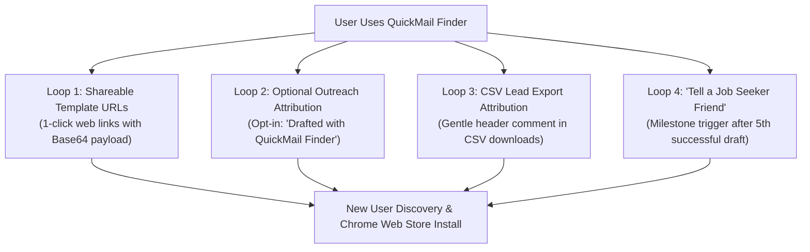

# QuickMail Finder — Organic Product Loops & Referral Engine (QMF-018)

**Audit Date:** 2026-09-13  
**Lead Architect:** Senior Product-Led Growth (PLG) Engineer & Viral Systems Designer  
**Target Growth Mechanism:** Product-Led Organic Virality & Self-Sustaining Referral Loops  
**Evidence Level:** `[VERIFIED]` (Compliant with privacy policies — attribution is strictly opt-in, CSV headers are non-breaking comments, and share prompts are milestone-triggered).

---

## 1. Product-Led Growth (PLG) System Architecture

The most scalable extensions don't rely only on external marketing; **every natural user action creates organic awareness for another potential user**.



---

## 2. Loop 1: 1-Click Shareable Template Links

Job seekers, career coaches, and freelance influencers frequently ask: *"Can you share that cold email template with me?"*

Instead of having users copy-paste raw text in DMs, QuickMail Finder lets users generate a **1-click Shareable Template URL**.

### Technical Implementation:
1. In the "Settings / Templates" tab, add a `🔗 Share Template` button beside the active template.
2. When clicked, it encodes the template title, subject, and body into a clean Base64 URL:
   `https://ashishingle29.github.io/quickmail/template.html?data=eyJ0aXRsZSI6IkpvYiBBcHBsaWNhdGlvbiIs...`
3. When another candidate or friend opens this link:
   * Displays the template with formatted dynamic tokens highlighted (`{name}`, `{company}`, `{driveLink}`).
   * Displays two prominent actions:
     * `📋 Copy Template to Clipboard`
     * `🚀 Install QuickMail Finder (Free)` to auto-import the template and use 1-click compose.

---

## 3. Loop 2: Optional Outreach Attribution / Signature

* **Privacy & Ethical Constraint:** **Default must be strictly OFF.** We never forcibly inject branding into users' personal job applications or business emails.
* **Opt-In Setting:**
  Inside the Settings tab:
  ```html
  <div class="setting-item-toggle">
    <label class="toggle-label">
      <input type="checkbox" id="enable-attribution-toggle" />
      <span>Add subtle footer to drafts: "Drafted with QuickMail Finder"</span>
    </label>
    <p class="setting-hint">Off by default. Enabling this helps fellow job seekers discover the free extension!</p>
  </div>
  ```
* **Output when enabled:** Appends a clean, professional footer at the very end of the drafted email body:
  ```text
  ---
  Drafted with QuickMail Finder (Free Chrome Extension)
  ```

---

## 4. Loop 3: CSV Export Attribution Header

When candidates build job application spreadsheets or freelance teams curate lead lists, they frequently share the resulting CSV file with peers, co-founders, or accountability groups.

### Technical Implementation:
Inside `downloadCsv()`, the first line of the file includes a gentle, non-breaking CSV comment header:
```csv
# Extracted with QuickMail Finder — Free Chrome Extension: https://chromewebstore.google.com/detail/quickmail-finder-%E2%80%94-detect/nmghnadnnkageenfiklgoghlelodmked
Email,Source Page Title,Source Page URL,Export Date
recruitment@stripe.com,"Careers at Stripe","https://stripe.com/jobs","2026-09-13 19:45"
```
* **Spreadsheet Compatibility:** Modern tools (Excel, Google Sheets, Pandas, Numbers) safely ignore lines starting with `#` as metadata comments, preserving clean column parsing while providing permanent organic referral attribution.

---

## 5. Loop 4: "Tell a Job Seeker Friend" Milestone Prompt

After a candidate successfully drafts **5 emails** (`draftsCreatedCount >= 5`), they are a verified happy user who has experienced significant time savings.

### Psychological Moment:
* The user is feeling momentum and relief during their job hunt.
* Empathy prompt: *"Job hunting is stressful for everyone. Know someone else grinding through applications?"*

### UI & 1-Click Social Share Actions:
* **In-Popup Banner:**
  ```
  +-------------------------------------------------------------+
  | 🤝 Know another job seeker?                             [✕] |
  | You've drafted 5 applications with QuickMail Finder!        |
  | Help a friend save hours on their job hunt today:           |
  |                                                             |
  |   [ 🐦 Share on X ]   [ 💼 LinkedIn ]   [ 💬 WhatsApp ]     |
  +-------------------------------------------------------------+
  ```
* **Pre-Filled Share Text:**
  * **Twitter / X:** *"If you're job hunting, check out QuickMail Finder. It finds recruiter emails on company pages and drafts Gmail applications in 1 click with your resume attached (100% free, no credit limits): [Link]"*
  * **LinkedIn:** *"Struggling with the ATS application black hole? QuickMail Finder lets you find recruiter emails and draft personalized cold emails in 1 click. Zero paywalls and totally free: [Link]"*
  * **WhatsApp:** *"Hey! If you're applying for jobs right now, check out this free Chrome extension called QuickMail Finder. It finds recruiter emails on company pages and opens pre-filled Gmail drafts in 1 click: [Link]"*

---

## 6. Throttling & Storage Mechanics

* Stored in `chrome.storage.local`:
  * `referralPromptDismissed`: Boolean (if dismissed once, never nag again).
  * `referralPromptShown`: Boolean.
  * `enableAttribution`: Boolean (default `false`).
