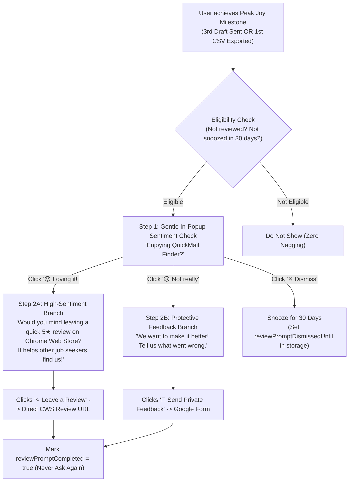

# QuickMail Finder — Review & Feedback Collection Engine (QMF-015)

**Audit Date:** 2026-09-13  
**Lead Architect:** Senior Product Growth Manager & CWS Reputation Specialist  
**Target Extension:** QuickMail Finder (`nmghnadnnkageenfiklgoghlelodmked`)  
**Direct Review Dialog URL:** `https://chromewebstore.google.com/detail/quickmail-finder-%E2%80%94-detect/nmghnadnnkageenfiklgoghlelodmked/reviews`  
**Private Feedback Form:** `https://forms.gle/2UYCV6p4bWYiG4jPA`  
**Evidence Level:** `[VERIFIED]` (CWS Developer Program policy compliant — no incentivized reviews, genuine sentiment routing).

---

## 1. The Strategy: Peak-Joy Sentiment Routing

Asking for a review at the wrong time is lethal:
* ❌ **Asking on first install:** Triggers frustration ("I haven't even used it yet!") $\rightarrow$ 1-star review.
* ❌ **Interrupting mid-compose:** Blocks the user while drafting an email $\rightarrow$ annoyance.
* ✅ **The "Peak Joy" Moment:** Asking immediately after a user achieves real value (e.g. successfully opens their 3rd Gmail draft or downloads their 1st clean CSV lead list).



---

## 2. Milestone Trigger Conditions

The review prompt evaluates the following triggers stored locally in `chrome.storage.local`:

| Milestone | Threshold | User Psychological State |
| :--- | :--- | :--- |
| **Drafts Created** | `draftsCreated >= 3` | The user has experienced the 1-click compose speed multiple times and loves the time savings. |
| **CSV Exports** | `csvExportsCount >= 1` | The user extracted a full list of contacts and obtained tangible offline value. |
| **Total Emails Found** | `totalEmailsDetected >= 20` | The user has actively used the tool across multiple websites. |

### Throttling Rules:
1. **Never Show on Day 1:** The extension must be installed for at least **24 hours** before any prompt can appear.
2. **Never Nag:** If dismissed via `✕`, suppress all prompts for **30 days**.
3. **Permanent Silence:** If the user clicks *"Leave a Review"*, *"Send Feedback"*, or *"Don't ask again"*, set `reviewPromptCompleted: true` permanently.

---

## 3. The 2-Step Copy & UI Design

### Step 1: Low-Friction Sentiment Check
```
+-------------------------------------------------------------+
| ✨ Enjoying QuickMail Finder?                           [✕] |
|                                                             |
|   [ 😍 Loving it! ]          [ 😕 Not really ]             |
+-------------------------------------------------------------+
```

### Step 2A (If "Loving it!"): Chrome Web Store Review
```
+-------------------------------------------------------------+
| ⭐ That makes our day!                                  [✕] |
| Could you spare 20 seconds to leave a 5-star review on the  |
| Chrome Web Store? It helps other job seekers find us!       |
|                                                             |
|   [ ⭐ Leave a Review ]       [ Maybe later ]               |
+-------------------------------------------------------------+
```

### Step 2B (If "Not really"): Private Feedback (Shields Store Rating)
```
+-------------------------------------------------------------+
| 💬 We want to make it right.                            [✕] |
| What can we improve? Let our engineer know directly so we   |
| can fix it for your favorite websites.                      |
|                                                             |
|   [ 📝 Send Feedback ]        [ Don't ask again ]           |
+-------------------------------------------------------------+
```

---

## 4. Chrome Policy Compliance Guarantee

Under Google's Chrome Web Store Developer Program Policies:
* ✅ **No compensation or incentives:** Users are never offered credits, money, or unlocked features for reviews.
* ✅ **Non-deceptive sentiment routing:** Both branches are voluntary; users can dismiss or close the dialog at any time.
* ✅ **Direct URL link:** Uses the official Chrome Web Store item review route (`/reviews`).

---

## 5. Technical Implementation Blueprint

* **HTML:** Add dismissible card container `#review-sentiment-card` in `popup.html` right above the email list.
* **CSS:** Add smooth slide-down animation and pill buttons in `popup.css`.
* **JS:** Add milestone increment counters and display logic in `popup.js`.
