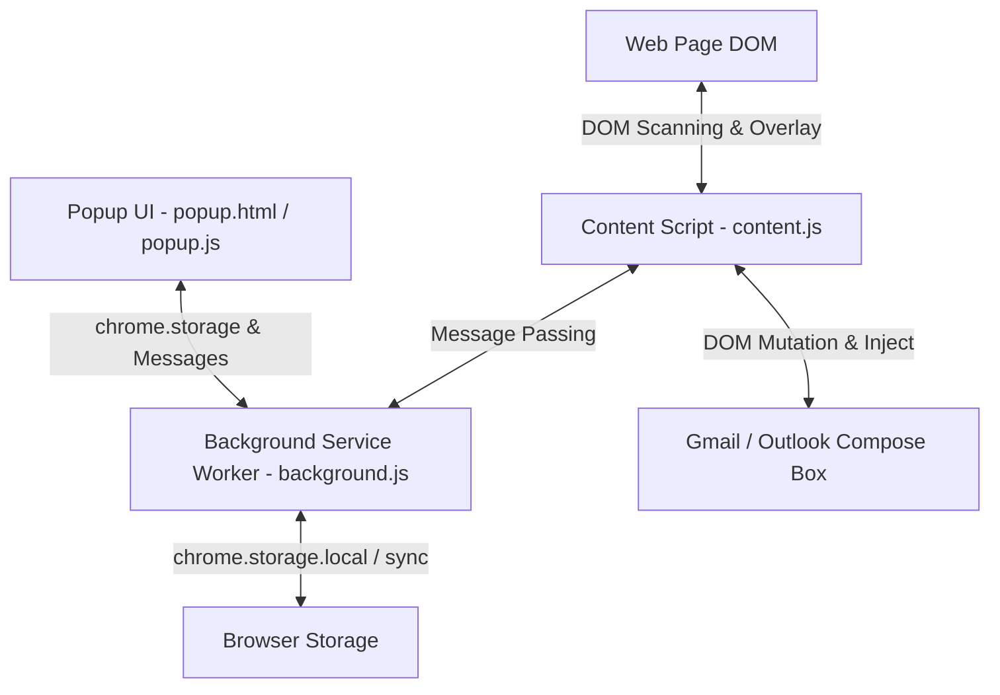

# Product Requirement Document (PRD) — QuickMail Finder

**Product Name**: QuickMail Finder — Detect & Draft Emails Anywhere  
**Platform**: Google Chrome Extension (Manifest V3)  
**Version**: 1.0.0  
**Target Audience**: Job Seekers, Recruiters, Sales Outreach Professionals, Business Development Reps, and Networking Enthusiasts.

---

## 1. Executive Summary & Product Vision

**QuickMail Finder** is a lightweight, high-performance Manifest V3 browser extension designed to instantly scan web pages (LinkedIn, Naukri, corporate career portals, company websites, etc.), extract email addresses in real time, and enable seamless, automated email drafting via Gmail or Microsoft Outlook in one click.

### Core Value Proposition
- **Zero Friction Extraction**: Automatically identifies valid email addresses on any web page without manual copying.
- **Smart Attachment Formatting**: Injects customizable Google Drive / PDF document attachment previews (Link, Pill, or Card) into Gmail and Outlook draft editors.
- **Multi-Window Isolation**: Opens each email draft in a dedicated popup window to prevent drafts from overwriting one another.
- **Privacy First**: Operates 100% locally in the user's browser using `chrome.storage`. No tracking, external backend APIs, or remote servers.

---

## 2. Problem Statement & User Pain Points

1. **Manual Email Copying**: Job seekers and sales reps manually select, copy, and paste email addresses from web pages into mail clients, wasting valuable time during high-volume outreach.
2. **Draft Overwrites in Gmail**: Standard deep links in Gmail often replace the active draft tab, accidentally destroying in-progress emails.
3. **Inconsistent Attachment Links**: Sharing Google Drive resume/portfolio links in emails looks unprofessional without proper card formatting.
4. **Lack of Contact History**: Users lose track of who they contacted, from which website, and whether an email was submitted or pending.

---

## 3. Architecture & System Overview

QuickMail Finder is built strictly on **Chrome Extension Manifest V3** standards with standard HTML5, CSS3, and modern ES6 JavaScript.



### Components Summary

| Component | File Path | Primary Responsibilities |
|---|---|---|
| **Manifest** | [`manifest.json`](file:///c:/Users/Ashish%20Ingle/OneDrive/Desktop/My%20First%20Extension/mail-extension/manifest.json) | MV3 Configuration, permissions (`storage`, `contextMenus`, `activeTab`, `scripting`, `tabs`, `<all_urls>`). |
| **Service Worker** | [`background.js`](file:///c:/Users/Ashish%20Ingle/OneDrive/Desktop/My%20First%20Extension/mail-extension/background.js) | Context menu listener, real-time extension badge counts, history grouping engine, staggered multi-window window creation. |
| **Content Script** | [`content.js`](file:///c:/Users/Ashish%20Ingle/OneDrive/Desktop/My%20First%20Extension/mail-extension/content.js) | DOM text traversal, Regex filtering, inline `✉` draft icon injection, view-port fixed side panel, dynamic compose attachment card enhancer. |
| **Content Styles** | [`content.css`](file:///c:/Users/Ashish%20Ingle/OneDrive/Desktop/My%20First%20Extension/mail-extension/content.css) | Injected icon styles, responsive quick-draft side panel positioning, animations. |
| **Popup UI** | [`popup.html`](file:///c:/Users/Ashish%20Ingle/OneDrive/Desktop/My%20First%20Extension/mail-extension/popup.html) / [`popup.js`](file:///c:/Users/Ashish%20Ingle/OneDrive/Desktop/My%20First%20Extension/mail-extension/popup.js) | Main extension user interface (On this page, History, Template tabs), theme control, manual email addition, CSV exports, template configuration. |
| **Design System** | [`popup.css`](file:///c:/Users/Ashish%20Ingle/OneDrive/Desktop/My%20First%20Extension/mail-extension/popup.css) | 435px locked responsive container, CSS theme engine (Light / Dark mode), custom scrollbars, form controls. |

---

## 4. Key Functional Features

### 4.1 Real-Time Email Scanner & Detection Engine
- **Single-Pass Text Node Traversal**: Efficiently scans `NodeFilter.SHOW_TEXT` nodes while skipping non-content tags (`SCRIPT`, `STYLE`, `IFRAME`, `TEXTAREA`, `INPUT`, `SVG`, `CANVAS`).
- **False-Positive Filtering**: Automatically excludes web graphic assets (`.png`, `.jpg`, `.jpeg`, `.gif`, `.svg`, `.webp`, `.ico`) misidentified as email domains.
- **Dynamic Content Monitoring**: Utilizes `MutationObserver` with 250ms debouncing and a 2.5s fallback interval to catch lazily loaded content (e.g., infinite scrolling on LinkedIn/Naukri).

### 4.2 On-Page Quick Draft Side Panel
- Inject a subtle `✉` icon adjacent to detected email text on any web page.
- Clicking the icon opens a floating, non-intrusive side panel with pre-filled fields (To, From Account, Subject, Body, Provider).
- Events inside the panel are isolated (`stopPropagation`) so page scripts don't close or break the overlay.

### 4.3 Flexible Detection & Power Controls
- **Global ON/OFF Switch**: Pauses scanner globally and hides injected icons with clear top banner notification.
- **Detection Modes**:
  - `Auto`: Automatically detects page emails and updates extension badge count.
  - `Manual`: Scans text without auto-adding to email history, allowing users to manually click `➕ Add to List & History`.

### 4.4 Template Customization & Smart Placeholders
- Supports email provider choice: **Gmail** or **Microsoft Outlook**.
- Multi-Account Support: Specify account index (`0`, `1`) or account email (`user@example.com`).
- **Dynamic Template Engine** supporting standard placeholders:
  - `{name}` — Inferred from email username (e.g. `ashish.ingle` -> `Ashish Ingle`).
  - `{company}` — Inferred from domain name (e.g. `google.com` -> `Google`).
  - `{email}` — Full recipient email address.
  - `{yourName}` — User's configured sender name.
  - `{driveLink}` / `{fileLink}` — Configured Google Drive URL.

### 4.5 Google Drive Attachment Card Enhancer
Injected into live Gmail (`mail.google.com`) and Outlook compose editors:
- **Clean Hyperlink**: Simple inline link with document icon (best spam deliverability).
- **Compact Attachment Pill**: Styled rounded button preview with red `PDF` badge and external link icon.
- **Full Document Box Card**: Rich HTML preview table card with document title, red PDF badge, and call-to-action button.

### 4.6 Contact History & Lead Management Engine
- Stores history grouped by unique recipient email address.
- Tracks `totalCount`, `firstSeen`, `lastSeen`, and detailed breakdown of all web page sources visited.
- Allows status toggling: `Pending` ⏳ vs `Submitted` ✅.
- Keywords search bar & status filter (`All`, `Pending`, `Submitted`).
- Bulk actions: Select All, Bulk Status Mark, Bulk Copy to Clipboard, Bulk Draft (Separate / BCC / To), and Export to Excel (`.csv`).

---

## 5. Technical Specifications & Data Schemas

### 5.1 Storage Schemas

#### `chrome.storage.sync` (Settings)
```json
{
  "isEnabled": true,
  "detectionMode": "auto",
  "theme": "system",
  "provider": "gmail",
  "fromAccount": "",
  "driveLink": "https://drive.google.com/file/d/...",
  "driveTitle": "Ashish_Ingle_CV.pdf",
  "driveStyle": "card",
  "subjectTemplate": "Regarding an opportunity at {company}",
  "bodyTemplate": "Hi {name},\n\nI came across your profile..."
}
```

#### `chrome.storage.local` (Email History)
```json
{
  "emailHistory": [
    {
      "email": "candidate@example.com",
      "status": "Pending",
      "firstSeen": 1725900000000,
      "lastSeen": 1725901000000,
      "totalCount": 2,
      "sources": [
        {
          "pageUrl": "https://linkedin.com/in/candidate",
          "pageTitle": "Candidate Profile | LinkedIn",
          "count": 2,
          "lastSeen": 1725901000000
        }
      ]
    }
  ]
}
```

---

## 6. UI / UX Design System

- **Container Constraints**: Fixed width of `435px`, locked viewport to eliminate horizontal scrollbars.
- **Color Palette (Dark Theme)**:
  - Background: Slate `#0b0f19`
  - Cards & Rows: Deep Navy `#141c2e`
  - Inputs & Dropdowns: Dark `#0f172a`
  - Borders: Subdued Blue-Gray `#233047`
  - Active Blue Accent: `#2563eb` / `#3b82f6`
  - Success Green: `#16a34a` / `#34d399`
- **Color Palette (Light Theme)**:
  - Background: Pure White `#ffffff`
  - Secondary Containers: `#f8fafc`
  - Text: Dark Slate `#0f172a`
  - Borders: Light Gray `#cbd5e1`
- **Typography**: Native System Font Stack (`-apple-system`, `BlinkMacSystemFont`, `Segoe UI`, `Roboto`).
- **Scrollbars**: Custom 5px thin smooth scrollbar thumb (`#28354d` in dark mode).

---

## 7. Future Expansion & Feature Roadmap

| Feature | Target Version | Description |
|---|---|---|
| **AI Email Personalization** | v1.1.0 | Integrate Chrome Built-in Prompt API (Gemini Nano) or OpenAI key to summarize page context and auto-generate tailored cover letters. |
| **Email Verification & Ping** | v1.2.0 | Add MX record validation / syntax checker to flag catch-all or invalid emails before drafting. |
| **Custom Webhooks & CRM Sync** | v1.3.0 | Export detected emails directly to Salesforce, HubSpot, Notion databases, or custom webhooks. |
| **Edge & Firefox Port** | v1.4.0 | Cross-browser compatibility package for Firefox Add-ons and Microsoft Edge Web Store. |

---

## 8. Verification & Compliance Checklist

- [x] **MV3 Service Worker Compliance**: Uses event-driven background scripts without persistent background pages.
- [x] **Privacy Compliance**: Zero third-party tracking scripts, zero external network calls; data remains inside local browser storage.
- [x] **CSS Isolation**: High-specificity classes (`.qmf-panel`, `.qmf-icon`, `.manual-add-bar`) prevent styling interference with target website CSS.
- [x] **Cross-Theme Parity**: Tested and verified in Light Mode, Dark Mode, and System Auto settings.
